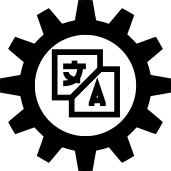

# Olbrasoft.Text

[](https://github.com/Olbrasoft/Text/actions/workflows/publish-nuget.yml)
[](LICENSE)
[](https://dotnet.microsoft.com/)

A comprehensive .NET library for text transformation, AI-powered embeddings, summarization, and professional translation services.

## Packages

### AI Text Transformation

| Package | Description | NuGet |
|---------|-------------|-------|
| **Olbrasoft.Text.Transformation.Abstractions** | Core interfaces for embedding, summarization and AI translation | [](https://www.nuget.org/packages/Olbrasoft.Text.Transformation.Abstractions/) |
| **Olbrasoft.Text.Transformation** | Base implementations for text transformation services | [](https://www.nuget.org/packages/Olbrasoft.Text.Transformation/) |
| **Olbrasoft.Text.Transformation.OpenAICompatible** | OpenAI-compatible API implementations (Ollama, LM Studio) | [](https://www.nuget.org/packages/Olbrasoft.Text.Transformation.OpenAICompatible/) |
| **Olbrasoft.Text.Transformation.Cohere** | Cohere, Gemini and Voyage AI embedding services | [](https://www.nuget.org/packages/Olbrasoft.Text.Transformation.Cohere/) |

### Professional Translation

| Package | Description | NuGet |
|---------|-------------|-------|
| **Olbrasoft.Text.Translation.Abstractions** | Core interfaces for translation services | [](https://www.nuget.org/packages/Olbrasoft.Text.Translation.Abstractions/) |
| **Olbrasoft.Text.Translation.DeepL** | DeepL translation service implementation | [](https://www.nuget.org/packages/Olbrasoft.Text.Translation.DeepL/) |
| **Olbrasoft.Text.Translation.Azure** | Azure Translator service implementation | [](https://www.nuget.org/packages/Olbrasoft.Text.Translation.Azure/) |
| **Olbrasoft.Text.Translation.Google** | Google Translate free API (unofficial, no key required) | [](https://www.nuget.org/packages/Olbrasoft.Text.Translation.Google/) |
| **Olbrasoft.Text.Translation.Bing** | Bing Translator free API (unofficial, no key required) | [](https://www.nuget.org/packages/Olbrasoft.Text.Translation.Bing/) |

### Markdown Processing

| Package | Description | NuGet |
|---------|-------------|-------|
| **Olbrasoft.Text.Transformation.Markdown** | Markdown to HTML/PlainText + ASP.NET TagHelper | [](https://www.nuget.org/packages/Olbrasoft.Text.Transformation.Markdown/) |

---

## AI Text Transformation

Generate vector embeddings, summarize content, and translate text using AI providers like Ollama, Cohere, Gemini, and Voyage.

### Installation

```bash
# Core abstractions
dotnet add package Olbrasoft.Text.Transformation.Abstractions

# For Ollama/LM Studio (local AI)
dotnet add package Olbrasoft.Text.Transformation.OpenAICompatible

# For Cohere/Gemini/Voyage (cloud AI)
dotnet add package Olbrasoft.Text.Transformation.Cohere
```

### Embedding Service

Generate vector embeddings for semantic search and similarity matching:

```csharp
public class SearchService
{
    private readonly IEmbeddingService _embeddingService;

    public SearchService(IEmbeddingService embeddingService)
    {
        _embeddingService = embeddingService;
    }

    public async Task<float[]?> GetEmbeddingAsync(string text, bool isQuery = false)
    {
        var inputType = isQuery ? EmbeddingInputType.Query : EmbeddingInputType.Document;
        return await _embeddingService.GenerateEmbeddingAsync(text, inputType);
    }
}
```

### Summarization Service

Summarize long text content using AI:

```csharp
public class ContentService
{
    private readonly ISummarizationService _summarizer;

    public ContentService(ISummarizationService summarizer)
    {
        _summarizer = summarizer;
    }

    public async Task<string?> SummarizeAsync(string content)
    {
        var result = await _summarizer.SummarizeAsync(content);
        return result.Success ? result.Summary : null;
    }
}
```

### Supported Providers

| Provider | Package | Use Case |
|----------|---------|----------|
| **Ollama** | OpenAICompatible | Local embeddings & summarization |
| **LM Studio** | OpenAICompatible | Local AI models |
| **Cohere** | Cohere | Cloud embeddings & translation |
| **Gemini** | Cohere | Google AI embeddings |
| **Voyage AI** | Cohere | High-quality embeddings |

---

## Professional Translation

High-quality translation using professional services with auto language detection.

### Installation

```bash
# DeepL (recommended for quality)
dotnet add package Olbrasoft.Text.Translation.DeepL

# Azure Translator (Microsoft)
dotnet add package Olbrasoft.Text.Translation.Azure

# Google Translate (free, no API key required)
dotnet add package Olbrasoft.Text.Translation.Google

# Bing Translator (free, no API key required)
dotnet add package Olbrasoft.Text.Translation.Bing
```

### Usage

```csharp
public class TranslationService
{
    private readonly ITranslator _translator;

    public TranslationService(ITranslator translator)
    {
        _translator = translator;
    }

    public async Task<string?> TranslateAsync(string text, string targetLanguage)
    {
        // Source language auto-detected
        var result = await _translator.TranslateAsync(text, targetLanguage);
        return result.Success ? result.Translation : null;
    }
}
```

### Configuration

**DeepL (API key required):**
```csharp
services.AddSingleton<ITranslator>(sp =>
    new DeepLTranslator(new DeepLSettings { ApiKey = "your-api-key" }));
```

**Azure Translator (API key required):**
```csharp
services.AddSingleton<ITranslator>(sp =>
    new AzureTranslator(new AzureTranslatorSettings
    {
        SubscriptionKey = "your-key",
        Region = "westeurope"
    }));
```

**Google Translate (free, no API key):**
```csharp
services.AddSingleton<ITranslator, GoogleFreeTranslator>();
services.Configure<GoogleFreeTranslatorSettings>(options =>
{
    options.TimeoutSeconds = 10;
});
```

**Bing Translator (free, no API key):**
```csharp
services.AddSingleton<ITranslator, BingFreeTranslator>();
services.Configure<BingFreeTranslatorSettings>(options =>
{
    options.TimeoutSeconds = 10;
});
```

> **Note:** Google and Bing use unofficial APIs via web scraping. Rate limits may apply (~100 req/hour for Google). Best for personal/low-volume use.

---

## Markdown Transformation

Transform Markdown to HTML or plain text with ASP.NET Core TagHelper support.

### Installation

```bash
dotnet add package Olbrasoft.Text.Transformation.Markdown
```

### Setup

```csharp
// Program.cs
builder.Services.AddTextTransformationMarkdown();
```

```razor
@* _ViewImports.cshtml *@
@addTagHelper *, Olbrasoft.Text.Transformation.Markdown
```

### Usage in Views

```html
<markdown>
# Hello World

This is **bold** and *italic* text.

- Item 1
- Item 2
</markdown>
```

### Programmatic Usage

```csharp
public class MyService
{
    private readonly IMarkdownTransformer _transformer;

    public MyService(IMarkdownTransformer transformer)
    {
        _transformer = transformer;
    }

    public string ToHtml(string markdown) => _transformer.ToHtml(markdown);
    public string ToPlainText(string markdown) => _transformer.ToPlainText(markdown);
}
```

---

## Building from Source

```bash
git clone https://github.com/Olbrasoft/Text.git
cd Text
dotnet build
dotnet test
```

## License

MIT License - see [LICENSE](LICENSE) for details.

## Author

**Jiri Tuma** | [Olbrasoft](https://github.com/Olbrasoft)

---

<p align="center">
  
  
</p>

<p align="center"><strong>Copyright 2020-2025 Olbrasoft</strong></p>
